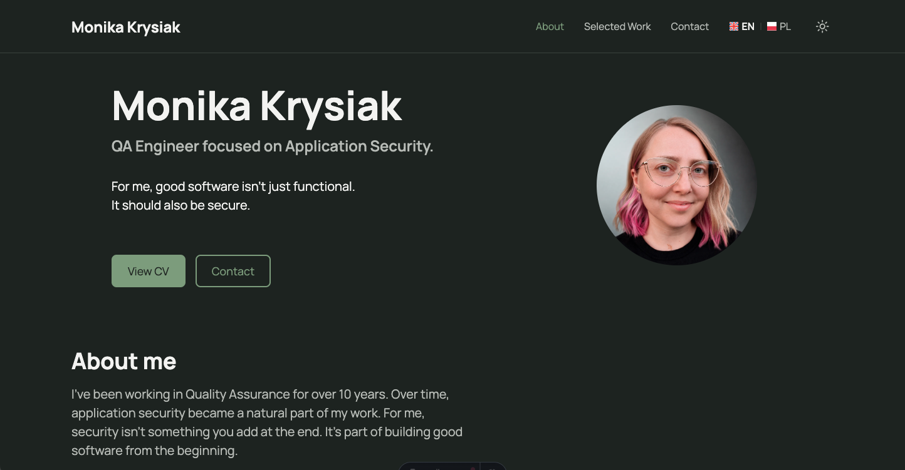

# Monika Krysiak – Portfolio

QA Engineer focused on Application Security

> A portfolio demonstrating engineering quality through accessibility, security, maintainable architecture, and real-world case studies.

<p align="center">
  
</p>

🌐 **Live website:** <https://monikaakrysiak.github.io/>

---

## About

This project serves two equally important goals:

- present my professional experience through real engineering case studies,
- deepen my understanding of modern frontend development by making every architectural decision consciously.

Rather than following tutorials, the project was developed incrementally with a strong focus on maintainability, accessibility, security, and long-term scalability.

---

## Featured Case Studies

- **Bringing Security into Everyday QA**
  - Practical application of OWASP ASVS, secure testing practices, and knowledge sharing.

- **Beyond Testing**
  - Real-world examples of business analysis, product thinking, and cross-functional collaboration.

- **Teaching & Knowledge Sharing**
  - Documentation, workshops, onboarding materials, and knowledge transfer.

- **Building This Portfolio**
  - Architecture decisions, accessibility, design system, internationalization, and engineering practices behind this project.

---

## Highlights

- 🌍 English and Polish versions
- ♿ Accessibility-first approach
- 🔒 Security by Default mindset
- ⚡ Static Site Generation with Astro
- 🎨 Design Token–based design system
- 🌗 Light and dark themes
- 📱 Responsive layout
- 🧩 Reusable component architecture
- 📚 Architecture Decision Records (ADR)
- 📝 Development Session Logs

---

## Technology Stack

- Astro
- TypeScript
- HTML5
- CSS
- Git
- GitHub Actions
- GitHub Pages

---

## Project Structure

```text
src/
├── assets/
├── components/
├── data/
├── i18n/
├── layouts/
├── pages/
├── styles/
└── utils/

docs/
├── adr/
├── reviews/
└── sessions/
```

---

## Engineering Quality

### Accessibility

The project follows an accessibility-first approach.

Implemented features include:

- Semantic HTML
- Keyboard navigation
- Visible focus states
- Screen reader support
- Reduced Motion support
- WCAG-oriented design

Final validation included:

- ✅ Lighthouse
- ✅ Axe
- ✅ WAVE

### Performance

The project is optimized through:

- Static Site Generation
- Optimized images
- Local assets
- Minimal dependency footprint

### Engineering Practices

The repository follows several engineering principles:

- Security by Default
- Design Token architecture
- Component-based architecture
- ADR-driven development
- Small incremental iterations

---

## Local Development

### Requirements

- Node.js >= 22.12.0

### Clone the repository

```bash
git clone https://github.com/MonikaAKrysiak/monikakrysiak.github.io.git
cd monikakrysiak.github.io
```

### Install dependencies

```bash
npm install
```

### Start the development server

```bash
npm run dev
```

### Build for production

```bash
npm run build
```

### Preview the production build

```bash
npm run preview
```

---

## Documentation

Project decisions are documented throughout development.

- [Project Overview](docs/PROJECT_OVERVIEW.md)
- [Architecture Decision Records](docs/adr/)
- [Development Sessions](docs/sessions/)

---

## Roadmap

Version **1.0.0** represents the first stable public release.

Future development will continue through small, incremental iterations and may include:

- additional engineering case studies,
- technical articles,
- conference talks and publications,
- continuous accessibility improvements,
- ongoing performance optimizations.

---

## License

This repository is provided for portfolio and demonstration purposes.

Unless stated otherwise, all rights are reserved.

For licensing details, see the [LICENSE](LICENSE) file.

---

Created and maintained by **Monika Krysiak**.